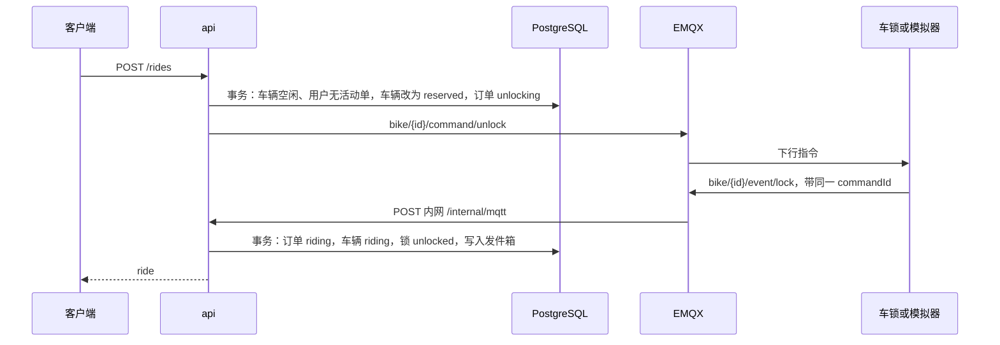

# 后端技术方案

业务规则以 `docs/技术方案.md` 为准。本文约定 `api` 如何用 Node.js、Express、Prisma、PostgreSQL、Redis、RabbitMQ、EMQX 和 Docker 实现这些规则。表结构、状态机、接口字段和消息格式以本文为准。

`api/` 提供 HTTP 接口，并用 Prisma 访问 PostgreSQL。`docker-compose.yml` 启动 PostgreSQL、Redis、RabbitMQ 和 EMQX。小程序和 H5 的开锁、还车、附近车辆和订单都请求这些接口。

## 目标

第一期交付一个可运行的 `api`：

1. 扫车身码创建订单，下发开锁，收到同一 `commandId` 的锁回报后进入骑行中。
2. 扫地面码还车。围栏、精度、二维码、车辆位置任一不通过就拒绝，并写下还车尝试。
3. 通过后下发关锁。收到同一 `commandId` 的回报后结束订单，返回费用。
4. 附近车辆和停车点可供地图使用。
5. 用 MQTT 模拟器扮演车锁，处理路径与以后的真锁相同。

第一期不做支付渠道、多边形围栏、停车点容量和后台管理页面。

## 运行时


| 组件   | 选型                    | 职责                 |
| ---- | --------------------- | ------------------ |
| 语言   | Node.js 22，TypeScript | 全部业务代码             |
| HTTP | Express               | 对外接口和 EMQX 上行入口    |
| 数据库  | PostgreSQL 16         | 落账与审计              |
| 访问层  | Prisma                | 迁移、查询、事务           |
| 实时状态 | Redis 7（ioredis）      | 车辆状态、GEO、还车互斥、指令等待 |
| 业务消息 | RabbitMQ 3（amqplib）   | 通知和轨迹归档            |
| 设备消息 | EMQX 5（MQTT.js 发布指令）  | 开锁、关锁和锁上报          |
| 部署   | Docker Compose        | `api` 与四个中间件       |


`api` 是单个 Node 进程，里面同时跑：

- 公网 HTTP（默认 `3000`）：客户端接口
- 内网 HTTP（默认 `3001`）：只给 EMQX 规则引擎回调，不映射到宿主机
- MQTT 客户端：向 EMQX 发布开锁、关锁指令
- RabbitMQ 消费者：通知、轨迹归档
- 发件箱轮询：事务提交后再把业务事件发到 RabbitMQ

设备上行不由这个进程订阅 MQTT。EMQX 规则引擎把上行消息 POST 到内网端口，避免心跳把业务队列打满，也避免 `api` 既当客户端又自己收自己发出的指令。

金额在结束订单的数据库事务里算好并写入。RabbitMQ 不决定还车是否成功，也不改费用。队列只做通知和归档，失败可重试。这样还车接口能立刻把费用返回给页面。

## 目录

```text
api/
  prisma/schema.prisma
  prisma/migrations/          Prisma 迁移；部分唯一索引写在 SQL 迁移里
  prisma/seed.ts              演示车辆、停车点、开发用户
  src/index.ts                启动：迁移已在容器入口执行，这里连依赖、灌 Redis、监听端口
  src/app.ts                  Express 应用
  src/config.ts               读取环境变量
  src/http/routes/            auth、rides、bikes、parking-points、me
  src/http/internal.ts        EMQX 上行回调
  src/http/middleware/        鉴权、错误响应
  src/domain/fee.ts           与 web/src/utils/fee.ts 同一套计费
  src/domain/geo.ts           与 web/src/utils/geo.ts 同一套球面距离
  src/domain/gcj.ts           与 web/src/utils/gcj.ts 同一套 WGS-84 转 GCJ-02
  src/domain/track.ts         行程点抽稀、轨迹折线和里程
  src/domain/return-check.ts  还车六步判定（容量除外）
  src/modules/                开锁、还车、附近查询的用例
  src/infra/                  Prisma、Redis、RabbitMQ、MQTT
  src/workers/                发件箱投递、通知、轨迹归档
  src/simulator/lock.ts       第一期车锁模拟器，单独进程
  Dockerfile
  package.json
docker-compose.yml            仓库根目录
.env.example
```

领域函数从客户端抄规则，不从客户端发来的「是否在区域内」字段采信。客户端只上报码、坐标、精度和时间。

## 配置

账号和密钥只来自环境变量。`.env.example` 里放变量名和说明，不放可用口令。


| 变量                                    | 作用                                                           |
| ------------------------------------- | ------------------------------------------------------------ |
| `DATABASE_URL`                        | Prisma 连接串，Compose 内为 `postgresql://…@postgres:5432/bicycle` |
| `REDIS_URL`                           | `redis://redis:6379`                                         |
| `RABBITMQ_URL`                        | `amqp://…@rabbitmq:5672`                                     |
| `MQTT_URL`                            | `mqtt://emqx:1883`                                           |
| `MQTT_USERNAME` / `MQTT_PASSWORD`     | `api` 作为发布者的 EMQX 账号                                         |
| `EMQX_WEBHOOK_SECRET`                 | 内网回调请求头 `X-Webhook-Secret`                                   |
| `JWT_SECRET`                          | 登录令牌                                                         |
| `WECHAT_APPID` / `WECHAT_SECRET`      | 小程序 `code2Session`，不提交                                       |
| `AMAP_KEY`                            | 预留。还车判定不调用高德                                                 |
| `ZONE_BUFFER_M`                       | 围栏容差，默认 `15`                                                 |
| `ACCURACY_LIMIT_M`                    | 精度上限，默认 `30`                                                 |
| `BIKE_USER_DISTANCE_M`                | 车载定位与用户定位的容差，默认 `80`                                         |
| `BIKE_LOCATION_MAX_AGE_MS`            | 车载定位可参与判定的最大时延，默认 `120000`                                   |
| `COMMAND_TIMEOUT_MS`                  | 等待锁回报，默认 `8000`                                              |
| `TRACK_MIN_INTERVAL_MS`               | 同一来源两点的最短间隔，默认 `15000`                                      |
| `TRACK_MIN_DISTANCE_M`                | 同一来源两点的最短距离，默认 `15`                                         |
| `TRACK_ACCURACY_LIMIT_M`              | 行程点精度上限，默认 `80`。还车判定仍用 `ACCURACY_LIMIT_M`                   |
| `HTTP_PORT` / `INTERNAL_PORT`         | `3000` / `3001`                                              |
| `SEED_ANCHOR_LAT` / `SEED_ANCHOR_LNG` | 种子数据的 GCJ-02 锚点                                              |


开发环境额外允许 `POST /auth/dev`。`NODE_ENV=production` 时这个路由不注册。

## 数据模型

金额用分（整数）。接口对外把费用换成元，保留两位小数，类型为数字，与页面里的 `fee: number` 一致。

坐标一律是 GCJ-02 的十进制度。Prisma 用 `Decimal(9, 6)` 存经纬度。

```prisma
enum BikeStatus {
  idle
  reserved
  riding
  maintenance
}

enum LockState {
  locked
  unlocked
  unknown
}

enum RideStatus {
  unlocking
  riding
  locking
  finished
  cancelled
}

enum CommandAction {
  unlock
  lock
}

enum CommandStatus {
  pending
  acked
  timeout
}

enum AttemptResult {
  accepted
  rejected
}

enum PointSource {
  user
  device
}

model User {
  id        String   @id @default(cuid())
  openid    String?  @unique
  nickname  String
  phone     String?
  createdAt DateTime @default(now())
  rides     Ride[]
}

model Bike {
  id         String     @id
  bodyCode   String     @unique
  status     BikeStatus @default(idle)
  lockState  LockState  @default(unknown)
  latitude   Decimal?   @db.Decimal(9, 6)
  longitude  Decimal?   @db.Decimal(9, 6)
  accuracy   Float?
  battery    Int?
  locationAt DateTime?
  lastSeenAt DateTime?
  updatedAt  DateTime   @updatedAt
  rides      Ride[]
}

model ParkingPoint {
  id        String   @id @default(cuid())
  code      String   @unique
  name      String
  latitude  Decimal  @db.Decimal(9, 6)
  longitude Decimal  @db.Decimal(9, 6)
  radius    Int
  enabled   Boolean  @default(true)
  capacity  Int?
  rides     Ride[]
}

model Ride {
  id             String      @id
  userId         String
  bikeId         String
  status         RideStatus
  startedAt      DateTime?
  endedAt        DateTime?
  parkingPointId String?
  feeCents       Int?
  distanceMeters Int?
  track          Json?
  createdAt      DateTime    @default(now())
  updatedAt      DateTime    @updatedAt
  user           User        @relation(fields: [userId], references: [id])
  bike           Bike        @relation(fields: [bikeId], references: [id])
  parkingPoint   ParkingPoint? @relation(fields: [parkingPointId], references: [id])
  commands       DeviceCommand[]
  attempts       ReturnAttempt[]
  points         RidePoint[]
}

model DeviceCommand {
  id        String        @id
  rideId    String
  bikeId    String
  action    CommandAction
  status    CommandStatus @default(pending)
  sentAt    DateTime      @default(now())
  ackedAt   DateTime?
  ride      Ride          @relation(fields: [rideId], references: [id])
}

model ReturnAttempt {
  id         String        @id @default(cuid())
  rideId     String
  code       String
  latitude   Decimal       @db.Decimal(9, 6)
  longitude  Decimal       @db.Decimal(9, 6)
  accuracy   Float
  locatedAt  DateTime
  result     AttemptResult
  reason     String?
  createdAt  DateTime      @default(now())
  ride       Ride          @relation(fields: [rideId], references: [id])
}

model RidePoint {
  id         String      @id @default(cuid())
  rideId     String
  latitude   Decimal     @db.Decimal(9, 6)
  longitude  Decimal     @db.Decimal(9, 6)
  accuracy   Float?
  source     PointSource
  recordedAt DateTime
  createdAt  DateTime    @default(now())
  ride       Ride        @relation(fields: [rideId], references: [id])

  @@index([rideId, recordedAt])
}

model Outbox {
  id          String    @id @default(cuid())
  routingKey  String
  payload     Json
  publishedAt DateTime?
  createdAt   DateTime  @default(now())
}
```

Prisma 不能声明部分唯一索引。迁移里另加：

```sql
CREATE UNIQUE INDEX "ride_one_active_per_user"
  ON "Ride" ("userId")
  WHERE status IN ('unlocking'::"RideStatus", 'riding'::"RideStatus", 'locking'::"RideStatus");

CREATE UNIQUE INDEX "ride_one_active_per_bike"
  ON "Ride" ("bikeId")
  WHERE status IN ('unlocking'::"RideStatus", 'riding'::"RideStatus", 'locking'::"RideStatus");
```

同一用户、同一车辆在「等待开锁、骑行中、等待关锁」三种状态下只能有一行。这是开锁互斥的最终保证。Redis 只负责还车请求的短时互斥。

`Bike.id` 是漆在车上的编号，也是 MQTT 主题里的 `bikeId`。`bodyCode` 是车身二维码里的短码。演示数据里两者相同，这样 `docs/qr/` 里的 `BK8K2M` 能直接开锁。正式环境的 `bodyCode` 必须不可猜测，并且和漆号分开。地面码用 `ParkingPoint.code`。

`Ride.id` 由服务端生成，形如 `R202609290001`，页面直接展示。`startedAt` 在开锁回报到达时写入，不在下单时写入，避免把等待开锁的时间算进费用。

`capacity` 第一期不参与判定。

### 行程点与轨迹

`Bike` 的经纬度只保留这辆车的最新位置，下一笔订单会把它盖掉。进行中的坐标记在 `RidePoint`，一笔订单一行一个点。

只在订单状态为 `riding` 或 `locking` 时追加。`unlocking` 还没开始计费，`finished` 和 `cancelled` 不再写入。

| 来源 | `source` | 何时写入 |
| --- | --- | --- |
| 手机定位 | `user` | 客户端调用 `POST /rides/{id}/points`。还车请求里的用户坐标在关锁成功的事务里再记一次，作为终点 |
| 车锁定位 | `device` | MQTT 定位到达，且该车有 `riding` 或 `locking` 的订单。开锁回报若带坐标，在订单进入 `riding` 的同一事务里记为起点 |

`recordedAt` 用定位发生的时间：手机用 `locatedAt`，车锁用上报的 `ts`。不用插入数据库的时间。

抽稀按来源分开比较，避免手机点和车锁点互相抵消：

1. `accuracy` 大于 `TRACK_ACCURACY_LIMIT_M` 的点丢掉。精度为空的车锁点保留。
2. 与该订单上一个同来源点相比，距离小于 `TRACK_MIN_DISTANCE_M` 且时间间隔小于 `TRACK_MIN_INTERVAL_MS`，丢掉。
3. 距离或间隔任一达到阈值就保留。

原始点一直留在 `RidePoint`。`Ride.track` 和 `Ride.distanceMeters` 在订单结束后由 `bike.track` 消费者写入，进行中的订单这两列为 `null`。

`track` 是抽稀后的折线，JSON 数组，按 `recordedAt` 升序：

```json
[
  {
    "latitude": 31.2304,
    "longitude": 121.4737,
    "recordedAt": 1750000000000,
    "source": "user"
  }
]
```

生成规则：

- 车锁点不少于 2 个时，折线只用 `device`。否则只用 `user`。两套点不按时间混成一条线，避免手机和车锁相差几十米时轨迹来回跳。
- `distanceMeters` 是这条折线上相邻点的球面距离之和，单位米，四舍五入成整数。点少于 2 个时里程为 0，折线仍写入。
- 消费者按 `rideId` 幂等。`track` 已有值就直接确认，不重算。结束后不再追加 `RidePoint`，所以折线不会过时。

还车判定不用这张表。围栏看当次扫码坐标，车辆位置看 `Bike` 上的最新坐标。

## Redis

Redis 丢了可以从 PostgreSQL 和最近一次设备上报重建。`api` 启动时全量灌入车辆和停车点。


| 键                      | 类型     | 内容                                                 | 过期         |
| ---------------------- | ------ | -------------------------------------------------- | ---------- |
| `geo:bikes`            | GEO    | 成员是 `Bike.id`，坐标 GCJ-02                            | 无，随上报更新    |
| `geo:parking`          | GEO    | 成员是 `ParkingPoint.id`                              | 无，停车点变更时更新 |
| `bike:state:{id}`      | Hash   | `status`、`lock`、`battery`、`lat`、`lng`、`locationAt` | 无          |
| `ride:return:{rideId}` | String | 还车互斥，值为当前请求号                                       | 15 秒       |
| `cmd:{commandId}`      | List   | 锁回报写入后由等待中的请求 `BLPOP`                              | 30 秒       |


附近查询：`GEOSEARCH` 取候选，再按 id 回表读 PostgreSQL 的展示字段。车辆只返回 `status = idle`。停车点返回启用和停用的点，地图可据此区分；停用点扫码仍拒绝。

默认检索半径 2000 米，最多 50 条。

## 鉴权

除登录和健康检查外，公网接口都要 `Authorization: Bearer <jwt>`。

微信小程序：

1. 客户端 `uni.login` 取得 `code`。
2. `POST /auth/wechat`，正文 `{ "code": "..." }`。
3. `api` 用 `WECHAT_APPID`、`WECHAT_SECRET` 换 `openid`。
4. 没有用户就创建。返回 `{ "token", "user": { "id", "nickname" } }`。

令牌有效期 7 天。第一期不做刷新令牌和手机号。

H5 调试：`POST /auth/dev`，正文可空。固定落到种子用户（昵称「骑行用户」）。生产构建不提供该路由。

## 接口

错误正文统一为：

```json
{ "code": "OUT_OF_ZONE", "message": "不在还车区域" }
```

`message` 给页面直接展示，与 `docs/技术方案.md` 的失败原因一致。


| HTTP | `code`               | `message`    |
| ---- | -------------------- | ------------ |
| 401  | `UNAUTHORIZED`       | 请先登录         |
| 404  | `RIDE_NOT_FOUND`     | 订单不存在        |
| 409  | `ACTIVE_RIDE_EXISTS` | 你有未完成的订单     |
| 409  | `BIKE_UNAVAILABLE`   | 车辆不存在或正在使用   |
| 409  | `NO_ACTIVE_RIDE`     | 没有进行中的订单     |
| 400  | `INVALID_QR`         | 二维码无效        |
| 400  | `POOR_ACCURACY`      | 定位不准，请到空旷处重试 |
| 400  | `OUT_OF_ZONE`        | 不在还车区域       |
| 400  | `BIKE_OUT_OF_ZONE`   | 车辆不在还车区域     |
| 409  | `RETURN_IN_PROGRESS` | 正在关锁，请稍候     |
| 409  | `RIDE_NOT_RIDING`    | 订单不在骑行中      |
| 504  | `LOCK_TIMEOUT`       | 锁没有响应，请重试    |
| 409  | `SPOT_FULL`          | 车位已满（第一期不返回） |


### POST /auth/wechat

见上文。开发路由是 `POST /auth/dev`。

### GET /me

```json
{ "id": "…", "nickname": "骑行用户", "phone": null }
```


### GET /rides/current

没有进行中的订单时 `ride` 为 `null`。进行中指 `unlocking`、`riding`、`locking`。

```json
{ "ride": { "id": "R202609290001", "bikeCode": "BK8K2M", "startedAt": 1750000000000 } }
```

`startedAt` 是毫秒时间戳。还在 `unlocking` 时为 `null`。`bikeCode` 对应 `Bike.id`。

### GET /rides

只返回当前用户 `finished` 的订单，按结束时间倒序。

```json
{
  "orders": [
    {
      "id": "R2026092601",
      "bikeCode": "BK2P9L",
      "startedAt": 1750000000000,
      "endedAt": 1750000100000,
      "fee": 2,
      "parkingName": "东北还车点"
    }
  ]
}
```

`fee` 是元。尚未写入费用的订单不会出现在这个列表里。列表不带轨迹折线。

### POST /rides/{id}/points

骑行中上报手机定位。正文：

```json
{
  "latitude": 31.2304,
  "longitude": 121.4737,
  "accuracy": 12,
  "locatedAt": 1750000000000
}
```

订单必须属于当前用户，且状态为 `riding` 或 `locking`。坐标为 GCJ-02。通过抽稀则插入 `RidePoint`，`source` 为 `user`。被抽稀丢掉时也返回 204，客户端不必重试。不更新 `Bike` 的位置，车辆位置只认车锁。

### GET /rides/{id}/track

当前用户的这笔订单。已结束且 `track` 已写好时返回折线和里程。还在骑行，或折线尚未生成时，按生成规则从 `RidePoint` 现算，不把现算结果写回 `Ride`。

```json
{
  "distanceMeters": 860,
  "points": [
    {
      "latitude": 31.2304,
      "longitude": 121.4737,
      "recordedAt": 1750000000000,
      "source": "user"
    }
  ]
}
```

### GET /bikes/nearby

查询参数：`latitude`、`longitude`，可选 `radius`（米，默认 2000）。

```json
{
  "bikes": [
    { "code": "BK8K2M", "battery": 86, "latitude": 31.2304, "longitude": 121.4737 }
  ]
}
```


### GET /parking-points/nearby

参数同上。

```json
{
  "points": [
    {
      "code": "PK3N7Q",
      "name": "脚下还车点",
      "latitude": 31.2304,
      "longitude": 121.4737,
      "radius": 100,
      "enabled": true
    }
  ]
}
```


### POST /rides

开锁。正文：

```json
{ "code": "BK8K2M" }
```

`code` 可以是车身链接 `https://{域名}/b/{bodyCode}`，也可以是纯编号。解析规则与 `web/src/utils/qr.ts` 的 `parseCode(raw, "b")` 相同：先取 `/b/` 后的段，纯编号直接采用，其它 `http` 链接视为空。

成功时等待开锁回报，然后返回与 `GET /rides/current` 相同的 `ride` 对象，此时 `startedAt` 已有值。

### POST /rides/{id}/return

还车。正文：

```json
{
  "code": "PK3N7Q",
  "latitude": 31.2304,
  "longitude": 121.4737,
  "accuracy": 12,
  "locatedAt": 1750000000000
}
```

`code` 用 `parseCode(raw, "p")` 的规则解析。`latitude`、`longitude` 为 GCJ-02。`accuracy` 单位米。`locatedAt` 为客户端定位时间的毫秒时间戳。

成功：

```json
{
  "spotName": "脚下还车点",
  "duration": "03:12",
  "fee": 1.5,
  "endedAt": 1750000200000
}
```

`duration` 的格式与 `web/src/utils/fee.ts` 的 `formatDuration` 相同。`fee` 为元。

同一订单已经 `finished` 时再次调用，不重新判定围栏，直接返回当时的成功结果。判定失败仍写 `ReturnAttempt`，订单保持 `riding`。

### GET /health

返回 `{ "ok": true }`。不鉴权。给 Compose 健康检查用。

## 开锁




事务里用 `SELECT … FOR UPDATE` 锁住车辆行，再插入订单。部分唯一索引挡住并发的第二单。冲突翻译成 `BIKE_UNAVAILABLE` 或 `ACTIVE_RIDE_EXISTS`。

车辆先改为 `reserved`，避免回报到来之前被别人扫走。此阶段订单还不是骑行中，`startedAt` 为空。

指令：

```json
{
  "commandId": "01J…",
  "action": "unlock",
  "rideId": "R202609290001",
  "ts": 1750000000000
}
```

主题 `bike/{bikeId}/command/unlock`，QoS 1。

等待使用 Redis 列表 `cmd:{commandId}`。上行处理函数在校验 `commandId` 属于该车的 `pending` 开锁指令后 `RPUSH` 回报。HTTP 请求 `BLPOP`，超时即 `COMMAND_TIMEOUT_MS`。

超时：指令标为 `timeout`，订单改为 `cancelled`，车辆从 `reserved` 回到 `idle`。不写 `startedAt`，不发 `bike.ride.started`。用户可以再次开锁。

回报到达：

1. 订单 `unlocking` → `riding`，写入 `startedAt`。
2. 车辆 `reserved` → `riding`，锁状态 `unlocked`。
3. 指令 `acked`。
4. 同一事务写入发件箱，路由键 `bike.ride.started`。

迟到的回报若订单已是 `cancelled`，只更新锁状态和位置，不把订单复活。

## 还车

判定顺序固定。前一步失败就不再做后面的步骤。每一步失败都插入 `ReturnAttempt`，`result = rejected`，`reason` 用上表的 `message`。


| 顺序  | 检查                                     | 失败                           |
| --- | -------------------------------------- | ---------------------------- |
| 1   | 订单属于当前用户，且状态是 `riding`                 | 没有进行中的订单。若是 `locking`，返回正在关锁 |
| 2   | 地面码能找到停车点，且 `enabled`                  | 二维码无效                        |
| 3   | `accuracy` 是数字且 ≤ `ACCURACY_LIMIT_M`   | 定位不准，请到空旷处重试                 |
| 4   | 用户坐标到停车点中心的球面距离 ≤ 半径 + `ZONE_BUFFER_M` | 不在还车区域                       |
| 5   | 见下文                                    | 车辆不在还车区域                     |
| 6   | 容量。第一期跳过                               | 车位已满                         |


第 5 步：

- 没有车载定位，或 `locationAt` 早于 `BIKE_LOCATION_MAX_AGE_MS`：跳过，只信用户定位。
- 有新鲜车载定位：车在该停车点有效半径内，或车与用户的距离 ≤ `BIKE_USER_DISTANCE_M`，二者满足一个即可。

距离用球面公式，地球半径 6371000 米，与 `web/src/utils/geo.ts` 一致。第一期不调用 PostGIS。

通过后的步骤：

1. `SET ride:return:{rideId} NX EX 15`。失败返回 `RETURN_IN_PROGRESS`。
2. 事务：订单 `riding` → `locking`，插入 `pending` 关锁指令，插入 `accepted` 的还车尝试（尚未写停车点和费用）。
3. 发布 `bike/{bikeId}/command/lock`，正文与开锁相同，`action` 为 `lock`。
4. 等待同一 `commandId`。
5. 回报到达后的事务：
  - 订单 `locking` → `finished`
  - 写入 `endedAt`、`parkingPointId`、`feeCents`
  - 车辆 `riding` → `idle`，锁状态 `locked`，位置更新为这次上报（没有车载坐标就用用户坐标）
  - 指令 `acked`
  - 发件箱写入 `bike.ride.finished`
6. 释放互斥键。响应成功正文。

等待超时：指令标 `timeout`，订单从 `locking` 回到 `riding`，释放互斥键，返回 `LOCK_TIMEOUT`。已写入的 `accepted` 尝试保留。用户可以再次还车。

已经 `finished` 的重复请求在加锁之前就返回历史结果，不要求人还在围栏里。

## 计费

与 `web/src/utils/fee.ts` 相同：

- 时长按分钟向上取整，不足 1 分钟按 1 分钟。
- 15 分钟内 1.50 元。
- 超出部分每 15 分钟加 0.50 元，不足 15 分钟按 15 分钟计。

`feeCents = round(元 × 100)`。起步 150 分，阶梯 50 分。接口里的 `fee` 用 `feeCents / 100`。

计费时刻是 `endedAt`，起点是 `startedAt`。页面上的「预计费用」仍由客户端按同一公式本地计算；结算金额以还车响应为准。

## 车载定位

上行若 `coord` 为 `wgs84`，先用与 `web/src/utils/gcj.ts` 相同的公式换成 GCJ-02，再写入。缺省当作 `gcj02`。中国境外坐标不转换。

定位事件更新 `Bike` 的位置、精度、`locationAt` 和 Redis GEO。若该车有 `riding` 或 `locking` 的订单，再按行程点规则追加一条 `source = device` 的 `RidePoint`。不进 RabbitMQ，不改变订单状态。

开锁回报进入 `riding` 时，回报里的坐标按同样规则记为该订单的起点。关锁成功时，回报里的坐标记为车锁终点，还车请求里的用户坐标记为手机终点。这两次写入发生在结束订单的事务里，早于 `bike.ride.finished`。

心跳更新 `battery`、`lastSeenAt` 和 Redis 里的状态。心跳不产生行程点。心跳缺失不在第一期判为故障。

## EMQX


| 方向  | 主题                              | 发布者   |
| --- | ------------------------------- | ----- |
| 下行  | `bike/{bikeId}/command/unlock`  | `api` |
| 下行  | `bike/{bikeId}/command/lock`    | `api` |
| 上行  | `bike/{bikeId}/event/lock`      | 车锁    |
| 上行  | `bike/{bikeId}/event/location`  | 车锁    |
| 上行  | `bike/{bikeId}/event/heartbeat` | 车锁    |


锁状态上行：

```json
{
  "commandId": "01J…",
  "lock": "unlocked",
  "latitude": 31.2304,
  "longitude": 121.4737,
  "coord": "gcj02",
  "accuracy": 8,
  "battery": 86,
  "ts": 1750000000000
}
```

`commandId` 必须回带。没有 `commandId` 的锁状态只更新 `lockState`，不推进订单。`lock` 取 `locked` 或 `unlocked`。

定位上行可以没有 `commandId`，字段为 `latitude`、`longitude`、`coord`、`accuracy`、`ts`。心跳字段为 `battery`、`ts`。

规则引擎订阅 `bike/+/event/#`，向 `http://api:3001/internal/mqtt` POST。请求头带 `X-Webhook-Secret`。正文由规则组装成：

```json
{
  "bikeId": "BK8K2M",
  "event": "lock",
  "commandId": "01J…",
  "lock": "unlocked",
  "latitude": 31.2304,
  "longitude": 121.4737,
  "coord": "gcj02",
  "accuracy": 8,
  "battery": 86,
  "ts": 1750000000000
}
```

`event` 取主题第三段：`lock`、`location`、`heartbeat`。密钥不匹配返回 401。`bikeId` 在库里不存在返回 404，EMQX 不必重试业务上不存在的车。处理成功返回 204。

EMQX 认证用内置数据库。至少三个账号：`api`（可发布 `bike/+/command/#`）、`simulator`（可订阅指令、发布 `bike/+/event/#`）、预留给真锁的设备账号。匿名登录关闭。

## RabbitMQ

交换机 `bike.events`，类型 topic，持久化。死信交换机 `bike.events.dlx`。


| 队列                                       | 绑定                                       | 消费者                   |
| ---------------------------------------- | ---------------------------------------- | --------------------- |
| `bike.notify`                            | `bike.ride.started`、`bike.ride.finished` | 第一期写日志。以后换订阅消息或短信     |
| `bike.track`                             | `bike.ride.finished`                     | 读取该订单的 `RidePoint`，写入 `Ride.track` 和 `Ride.distanceMeters` |
| `bike.notify.retry` / `bike.track.retry` | 各自的重试                                    | TTL 到期后送回原队列          |
| `bike.notify.dlq` / `bike.track.dlq`     | 死信                                       | 超过 5 次不再投递，留待人工查看     |


消息持久化，消费手动 ack。处理函数按 `rideId` + 路由键做幂等：同一订单的开始或结束事件重复投递只生效一次。

消息体：

```json
{
  "rideId": "R202609290001",
  "bikeId": "BK8K2M",
  "userId": "…",
  "startedAt": 1750000000000,
  "endedAt": 1750000200000,
  "feeCents": 150,
  "parkingPointId": "…"
}
```

开始事件没有 `endedAt`、`feeCents`、`parkingPointId`。

发件箱：业务事务内插入 `Outbox`。进程内每 500 毫秒拉取 `publishedAt` 为空的行，发到 `bike.events`，成功后填 `publishedAt`。`api` 崩溃重启后续发。不在事务提交前发消息。

定位和心跳不进这个交换机。

## 模拟器

`src/simulator/lock.ts` 作为单独的 Node 进程，用 `simulator` 账号连接 EMQX。

- 订阅 `bike/+/command/#`。
- 收到开锁或关锁后，立刻向 `bike/{bikeId}/event/lock` 发布对应状态，并回带 `commandId`。
- 每 10 秒为种子车辆发布一次定位和心跳。定位用该车在 PostgreSQL 里的坐标，电量用种子值。

Compose 里用 profile `sim` 启动，不进生产编排。真锁接入后停掉模拟器，不改还车判定和主题。

## 种子数据

与 `web/src/data/places.ts` 对齐。锚点来自 `SEED_ANCHOR_LAT`、`SEED_ANCHOR_LNG`。东、北偏移用与 `offsetMeters` 相同的算法换成 GCJ-02。


| 类型  | 编号       | 说明                |
| --- | -------- | ----------------- |
| 车辆  | `BK8K2M` | 电量 86，空闲，锁关，车身码同号 |
| 车辆  | `BK2P9L` | 电量 64             |
| 车辆  | `BK7Q1C` | 电量 41             |
| 停车点 | `PK3N7Q` | 脚下还车点，半径 100 米，启用 |
| 停车点 | `PK9W4D` | 东北还车点，半径 70 米，启用  |
| 停车点 | `PK0X1Z` | 南侧还车点，半径 60 米，停用  |


偏移与前端一致：车辆分别为东/北 `(-45, 35)`、`(80, 20)`、`(25, -70)` 米；停车点为 `(0, 0)`、`(130, 60)`、`(-20, -140)` 米。

另建一个没有 `openid` 的开发用户，供 `POST /auth/dev` 使用。不播种历史订单。

`prisma/seed.ts` 可重复执行：按编号 upsert，不覆盖已经是 `riding` 的车辆状态。

## Docker

根目录 `docker-compose.yml`。


| 服务         | 镜像                      | 说明                                   |
| ---------- | ----------------------- | ------------------------------------ |
| `postgres` | `postgres:16`           | 库名 `bicycle`，数据卷 `pg-data`           |
| `redis`    | `redis:7`               | 数据卷 `redis-data`                     |
| `rabbitmq` | `rabbitmq:3-management` | 数据卷 `rabbitmq-data`。管理端口不映射到公网       |
| `emqx`     | `emqx/emqx:5`           | 数据卷 `emqx-data`。只映射 `1883`。控制台不映射到公网 |
| `api`      | 构建 `api/Dockerfile`     | 依赖前四者健康后启动                           |
| `lock-sim` | 同一 `api` 镜像，命令改为模拟器     | profile `sim`                        |


`api` 镜像用多阶段构建：编译 TypeScript，生成 Prisma Client，运行镜像基于 `node:22-alpine`，只带 `dist`、`prisma` 和生产依赖。启动命令先 `prisma migrate deploy`，再 `node dist/index.js`。

容器内地址用服务名：`postgres:5432`、`redis:6379`、`rabbitmq:5672`、`emqx:1883`。宿主机只发布 `api` 的 `3000` 和 EMQX 的 `1883`。`3001` 只在 Compose 网络内可达。

本地和生产用同一份 Compose。差别只在 env 文件：数据库口令、JWT、微信密钥、MQTT 账号、种子锚点。

健康检查：

- Postgres：`pg_isready`
- Redis：`redis-cli ping`
- RabbitMQ：`rabbitmq-diagnostics ping`
- EMQX：`emqx ctl status`
- `api`：`GET /health`


## 启动顺序

1. `prisma migrate deploy`
2. 若设置了 `SEED=1`，执行 seed
3. 连接 Redis，从 PostgreSQL 重建 GEO 和 `bike:state:*`
4. 连接 RabbitMQ，声明交换机、队列和绑定
5. 连接 EMQX，只用于下行发布
6. 启动发件箱轮询和消费者
7. 监听 `3000` 和 `3001`

收到 SIGTERM 时停止接新请求，等正在等待的锁回报结束或超时，断开 MQTT 和 RabbitMQ，再退出。

## 测试

不依赖 Docker 的测试：

- 计费：1 分钟、15 分钟、16 分钟、30 分钟
- 球面距离：停车点中心、半径上、半径加容差外
- 还车判定表的每一行失败，以及车载定位缺失时跳过第 5 步
- 二维码解析：链接、纯编号、错误的 `http` 链接
- 行程点抽稀：同来源的近点丢掉，手机点和车锁点互不影响
- 轨迹：车锁点不少于 2 个时只用车锁点，否则只用手机点；里程为折线长度

依赖 Compose 的测试：

- 两个并发开锁只有一个成功
- 模拟器回报后订单变为骑行中
- 区域外、停用停车点、精度 68 米都被拒绝，并且各有一条还车尝试
- 重复还车返回第一次的费用
- 关锁超时后订单仍是骑行中，可以再还一次
- 骑行中上报的手机定位进入 `RidePoint`；还车成功后 `bike.track` 写出折线和里程


## 和客户端的衔接

页面和交互不变。本地演示数据已改为请求 api：


| 原来                        | 现在                                                             |
| ------------------------- | -------------------------------------------------------------- |
| `startRide` 写本地存储         | `POST /rides`，用返回的 `id`、`bikeCode`、`startedAt`                 |
| 还车页本地算围栏和费用并 `clearRide`  | `POST /rides/{id}/return`。成功页用响应里的 `spotName`、`duration`、`fee` |
| `session.orders`          | `GET /rides`                                                   |
| 启动时 `hydrateRide`         | `GET /rides/current`                                           |
| `src/data/places.ts` 里的车辆 | `GET /bikes/nearby`、`GET /parking-points/nearby`               |
| 骑行中没有轨迹                   | 骑行页约每 15 秒 `POST /rides/{id}/points`                          |
| 无登录                       | 小程序先走 `/auth/wechat`，失败再走 `/auth/dev`；H5 走 `/auth/dev`        |


还车页上的「区域内 / 区域外 / 定位不准」只用于演示，正式请求只提交真实定位。服务端不提供切换判定结果的参数。

预计费用在骑行页仍然本地计算，公式保持和 `src/domain/fee.ts` 一致。

## 分期


### 第一期

本文全部内容：圆形围栏、软件规则加 MQTT 模拟锁、同步等待锁回报、费用在结束事务内落账、行程点与结束后的轨迹折线。

### 第二期

`ParkingPoint` 增加多边形（PostGIS `geometry`）。判定改为 `ST_Contains`，容差改为对外缓冲。接口路径和错误码不变。启用 `capacity`，还车事务里按「该点未完成离场的车辆数」判断 `SPOT_FULL`。管理端另做，不塞进这一个 `api` 进程的客户端路由里。

### 第三期

真锁替换模拟器，使用设备自己的 MQTT 账号。主题和 `commandId` 规则不变。车载定位已在第 5 步参与判定，只需保证上报频率高于 `BIKE_LOCATION_MAX_AGE_MS`。