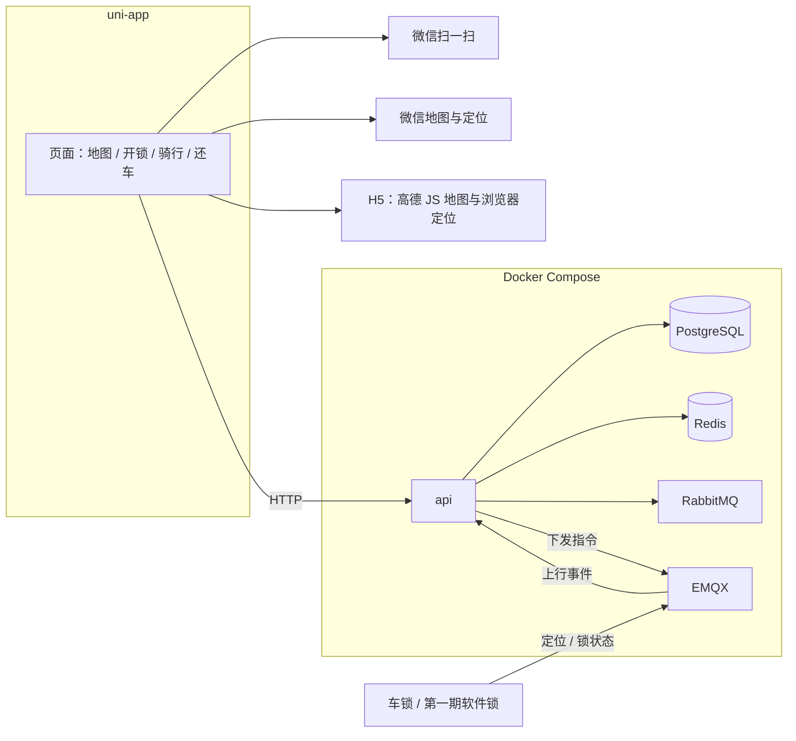

# 扫码还车技术文档

模仿青桔骑行的还车方式：用户把车停进指定区域，扫描地面二维码锁车。服务端同时校验围栏和二维码，通过后才结束订单。

本文确定技术选型和部署方式，作为实现依据。

## 目标

1. 扫描车身二维码开锁，开始骑行。
2. 在规定区域内扫描地面二维码锁车还车。区域外、无效码、定位过差时拒绝还车，并说明原因。

第一期用软件锁（订单与车辆状态变更即视为开关锁），但开锁、关锁、定位上报的消息通道按真实车锁预留。车载锁接入后，锁状态、车载定位和心跳通过 MQTT 上报到 EMQX，由 `api` 接收；只替换设备端，不改还车判定。

## 技术选型

| 层次 | 选型 | 职责 |
| --- | --- | --- |
| 客户端 | uni-app（Vue 3） | 同一套页面，按平台调用扫码、地图和定位 |
| 当前交付 | 微信小程序 | 用微信扫一扫和微信 `map` 组件 |
| 开发调试 | H5 | 浏览器相机扫码，高德 JS 地图 |
| 业务数据 | PostgreSQL | 用户、车辆、停车点、订单、还车记录 |
| 实时状态 | Redis | 车辆状态、附近检索、还车互斥 |
| 业务消息 | RabbitMQ | 计费、通知等异步任务 |
| 设备消息 | EMQX | 车锁指令与上报（MQTT） |
| 部署 | Docker 镜像 | 业务服务与中间件用 Compose 编排 |

客户端当前以微信小程序交付。H5 只用于开发调试。Android、iOS 仍可用同一套 uni-app 页面打包，但不是这一期的发布目标。Docker 部署 `api` 依赖的中间件。HTTP 接口已在 `api/`，客户端仍使用页面内演示数据。

## 总体架构



uni-app 负责页面。微信小程序里扫码、地图、定位都走微信接口，不使用浏览器 DOM。业务判定全部在 `api` 完成。

## 客户端

工程放在 `web/`，使用 uni-app（Vue 3）。页面说明见 `docs/前端说明.md`。

```text
web/
  src/pages/map/        附近地图，底部「扫码用车」
  src/pages/scan/       确认开锁，可输入编号
  src/pages/riding/     骑行中
  src/pages/return/     扫地面码还车
  src/pages/profile/    个人信息
  src/pages/orders/     历史订单
  src/pages.json
  src/manifest.json     小程序 AppID、定位权限、App 高德 Key
  src/App.vue
```

平台差异：

| 能力 | 微信小程序 | H5 | App |
| --- | --- | --- | --- |
| 开锁入口 | 地图底部「扫码用车」，直接打开微信扫一扫 | 进入开锁页，页内相机预览 | `uni.scanCode` |
| 还车扫码 | 「扫码还车」按钮，直接打开微信扫一扫 | 页内相机预览 | `uni.scanCode` |
| 地图 | 微信 `map` 组件，车辆标记和停车区圆 | 高德 JS API 2.0 | uni-app `map`（高德） |
| 定位 | `uni.getLocation`，`type` 为 `gcj02` | 浏览器定位，WGS-84 转 GCJ-02 | `uni.getLocation`，`type` 为 `gcj02` |

小程序里没有 `document`、`window` 和摄像头预览节点。扫码不嵌二维码框，交互对齐青桔：点按钮后由微信扫一扫完成识别。识别结果回到页面，用户再确认一次才开锁或还车。H5 仍用页面内相机，便于浏览器里调试。

微信小程序在 `manifest.json` 的 `mp-weixin` 中声明 `scope.userLocation`，并在 `requiredPrivateInfos` 里登记 `getLocation`。AppID 由本地填写，不把真实小程序号写进文档。App 的高德 Key 写在 `manifest.json` 的 SDK 配置里，由打包环境注入，不提交密钥。H5 的高德 Key 放在 `web/.env.development` 的 `VITE_AMAP_KEY`，该文件不提交。

## 定位

微信小程序和 App 通过 `uni.getLocation` 取 GCJ-02，并打开高精度。H5 使用浏览器高精度定位，把 WGS-84 转成 GCJ-02 后再参与围栏判断。还车时上报：

- 经纬度
- 精度 `accuracy`（米）
- 定位时间

停车点中心、围栏、车辆最近位置全部按 **GCJ-02** 存储和比较。车锁若上报 WGS-84，在写入前转换成 GCJ-02。地图展示、距离计算、围栏判断使用同一坐标系。

服务端若调用高德 Web 服务（路径、距离），Key 只放在 `api` 的环境变量里。还车判定本身只使用已上报的坐标和停车点数据，不在判定链路上实时请求高德。

## 还车规则

单靠定位不够，城市偏差常见 10–50 米。单靠扫码也不够，地面码可以被拍照后在区域外扫描。一次还车同时满足：

1. 地面码对应该停车点，证明扫的是这个点的码。
2. 定位落在该停车点区域内，证明人在这个点旁边。

服务端做最终判定。客户端只采集并上报。

### 开锁

1. 扫描车身二维码，解析出车辆编号。
2. 服务端确认车辆空闲，且该用户没有未完成订单。
3. 创建订单，车辆改为骑行中，经 EMQX 下发开锁指令，开始计费。

### 还车

1. 用户把车停进划定区域，扫描地面二维码。
2. 客户端上报地面码、高德经纬度、精度、订单号、车辆编号、时间戳。
3. 服务端按下表校验，任一失败即拒绝并返回原因。
4. 通过后经 EMQX 下发关锁，结束订单。计费与通知交给 RabbitMQ 异步完成。

| 顺序 | 检查 | 失败原因 |
| --- | --- | --- |
| 1 | 订单处于骑行中，且属于当前用户 | 没有进行中的订单 |
| 2 | 地面码有效、未停用，且对应一个停车点 | 二维码无效 |
| 3 | 定位精度可用（建议 ≤ 30 米） | 定位不准，请到空旷处重试 |
| 4 | 用户坐标落在该停车点区域内 | 不在还车区域 |
| 5 | 车辆最近位置也在同一区域，或与用户距离在容差内 | 车辆不在还车区域 |
| 6 | 该停车点未满（启用容量之后） | 车位已满 |

第 5 步在车锁尚未上报定位时，只采用高德定位。第 6 步第一期不做。

还车接口幂等：同一订单重复提交时，已成功的请求直接返回成功。并发请求用 Redis 互斥，避免重复结算。每次尝试写入还车记录。

### 区域

第一期使用圆形围栏：中心经纬度 + 半径（米），用球面距离判断。

- 有效半径 = 配置半径 + 容差（建议 15 米，可配置）
- 精度阈值建议 30 米，可配置

第二期改为多边形，用 PostGIS 的 `ST_Contains`。接口不变，只替换区域存储和判断函数。

### 二维码

短码不可猜测，内容为链接：

- 车身码：`https://{域名}/b/{code}`
- 地面码：`https://{域名}/p/{code}`

## 后端与中间件

`api` 是唯一业务入口，对外 HTTP，对内连接下面四个组件。同一车辆、同一用户的「骑行中」订单由数据库事务保证唯一。进程划分、表结构、接口字段、状态机和容器编排见 `docs/后端技术方案.md`。

### PostgreSQL

保存需要落账和审计的数据：用户、车辆档案、停车点、订单、还车尝试。车辆当前经纬度以这里的记录为准，Redis 中的位置是加速副本。

### Redis

- 车辆实时状态（空闲、骑行中、锁开闭、电量）。
- `GEO` 保存车辆和停车点坐标，附近查询走 `GEOSEARCH`。
- 还车互斥键，例如 `ride:{id}:return`，过期时间短于一次还车处理。
- 接口幂等结果短时缓存。

Redis 数据可以丢失后从 PostgreSQL 和最近一次设备上报重建。

### RabbitMQ

处理可以延迟、需要重试的业务，不承担设备在线通信：

- 还车成功后的计费落账
- 用户通知
- 轨迹归档：把该订单已保存的行程点收成折线和里程

业务交换机按事件划分，例如 `bike.ride.started`、`bike.ride.finished`。消费失败进入重试，超过次数进入死信队列。

### EMQX

车载锁接入后使用 MQTT 接收数据。锁作为 MQTT 客户端连接 EMQX，向主题发布锁状态、车载定位和心跳；`api` 订阅这些上行消息并落库。开锁、关锁指令也由 `api` 经同一连接下发。

| 方向 | 主题 | 内容 |
| --- | --- | --- |
| 下行 | `bike/{bikeId}/command/unlock` | 开锁 |
| 下行 | `bike/{bikeId}/command/lock` | 关锁 |
| 上行 | `bike/{bikeId}/event/lock` | 锁状态变化 |
| 上行 | `bike/{bikeId}/event/location` | 车载定位 |
| 上行 | `bike/{bikeId}/event/heartbeat` | 在线与电量 |

指令带唯一 `commandId`。锁回报同一 `commandId` 后，`api` 才把订单推进到下一状态。超时未回报则订单保持原状态，并允许用户重试。

第一期没有硬件时，由模拟器按同样主题发布锁状态和定位，`api` 的处理路径与真锁一致。

上行消息经 EMQX 规则引擎转发到 `api` 的内部入口。`api` 更新 Redis 与 PostgreSQL 中的车辆位置和锁状态。车辆有进行中的订单时，定位同时追加到该订单的行程点。定位事件不进 RabbitMQ，避免心跳淹没业务队列。订单结束后，再由轨迹消息把行程点收成折线。

## 接口

| 方法 | 路径 | 作用 |
| --- | --- | --- |
| POST | `/rides` | 扫车身码开锁，创建订单并下发开锁 |
| POST | `/rides/{id}/return` | 扫地面码还车，执行校验并下发关锁 |
| POST | `/rides/{id}/points` | 骑行中上报手机定位，写入该订单的行程点 |
| GET | `/rides/{id}/track` | 返回订单轨迹折线和里程 |
| GET | `/parking-points/nearby` | 按当前位置返回附近停车点及半径，供地图画圈 |
| GET | `/bikes/nearby` | 按当前位置返回附近可骑车辆 |

附近查询先读 Redis GEO，再回表补齐 PostgreSQL 中的展示字段。

## 核心数据

### 车辆

| 字段 | 说明 |
| --- | --- |
| 编号 | 业务主键，同时作为 MQTT 主题中的 `bikeId` |
| 车身码 | 不可猜测的短码 |
| 状态 | 空闲 / 骑行中 / 维修 |
| 最近经纬度 | GCJ-02，定位上报或开关锁时更新 |
| 锁状态 | 开 / 关，以锁回报为准 |

### 停车点

| 字段 | 说明 |
| --- | --- |
| 名称 | 展示用 |
| 中心经纬度 | GCJ-02 |
| 半径 | 米 |
| 地面码 | 不可猜测的短码 |
| 是否启用 | 停用后扫码拒绝 |
| 容量 | 第二期使用 |

### 订单

| 字段 | 说明 |
| --- | --- |
| 用户、车辆 | 关联 |
| 开始、结束时间 | 计费依据 |
| 还车停车点 | 成功还车后写入 |
| 费用 | 结束订单时写入 |
| 状态 | 骑行中 / 已完成 / 已取消 |
| 行程点 | 骑行中按时间追加的手机坐标和车锁坐标。车辆表只留最新位置 |
| 轨迹、里程 | 订单结束后由行程点生成。车锁点足够时只用车锁点，否则用手机点 |

### 还车尝试

记录每次扫码的 GCJ-02 坐标、精度、地面码、判定结果和失败原因。

## Docker 部署

除客户端外，全部以镜像运行。`api` 开始实现时，在仓库根目录添加 `docker-compose.yml` 编排下列服务。

| 服务 | 镜像 | 说明 |
| --- | --- | --- |
| `postgres` | `postgres:16` | 业务库，数据卷持久化 |
| `redis` | `redis:7` | 实时状态，数据卷持久化 |
| `rabbitmq` | `rabbitmq:3-management` | 业务消息，管理端口仅内网 |
| `emqx` | `emqx/emqx:5` | MQTT，1883 给设备和 `api`，控制台仅内网 |
| `api` | 由 `api/` 构建 | 业务服务，依赖上述四者健康后再启动 |

约定：

- 服务在同一 Docker 网络内用服务名访问，例如 `postgres:5432`、`redis:6379`、`rabbitmq:5672`、`emqx:1883`。
- 账号、密码、高德服务端 Key 来自环境变量或 env 文件，不写进镜像和文档中的默认口令。
- PostgreSQL、Redis、RabbitMQ 使用具名数据卷。EMQX 的规则和认证数据同样放入数据卷。
- `api` 镜像只包含业务程序。数据库结构变更随 `api` 发布执行，不在数据库镜像里写业务脚本。
- 对外只发布 `api` 的 HTTP 端口和 EMQX 的 MQTT 端口。管理端口不映射到公网。

本地与服务器使用同一份 Compose。差别只在环境变量（数据库口令、高德 Key、MQTT 账号）。

## 目录

```text
web/                 uni-app 客户端，当前打包微信小程序
docs/技术方案.md      本文
docs/后端技术方案.md  api 实现：Express、Prisma、消息、Docker
docs/前端说明.md      页面、平台差异和本地运行
docs/qr/             演示用车身码、地面码图片
```

## 分期

### 第一期：能还车

uni-app 客户端以微信小程序交付：微信扫一扫开锁和还车，微信地图展示车辆与圆形围栏。H5 保留浏览器扫码和高德地图，用于调试。Docker Compose 拉起 PostgreSQL、Redis、RabbitMQ、EMQX 和 `api`。用模拟器按 MQTT 主题扮演车锁。目标是演示「只有在区域内扫到对应地面码才能还车」。

### 第二期：可运营

多边形围栏、停车点容量、后台划定区域并生成地面码。页面仍在同一套 uni-app 工程里扩展。

### 第三期：真锁

真实车锁接入 EMQX，锁状态、车载定位和心跳全部经 MQTT 上报。服务端仍以下发指令、收到同一 `commandId` 的锁回报作为状态推进条件。车载定位与高德定位做交叉校验。
